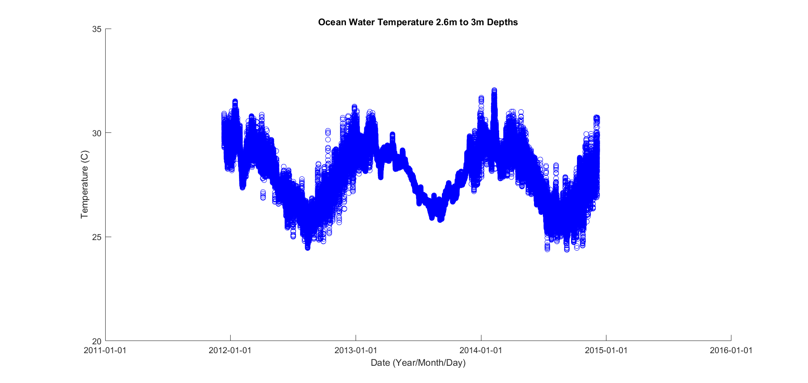
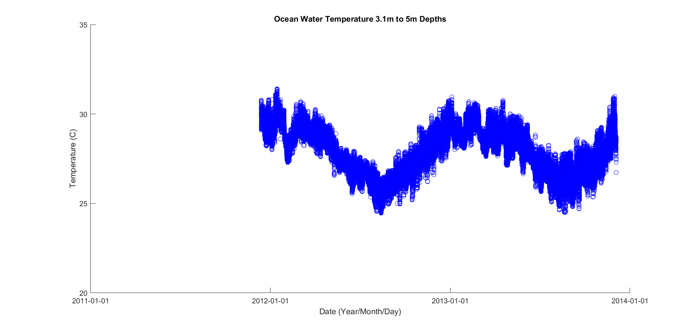
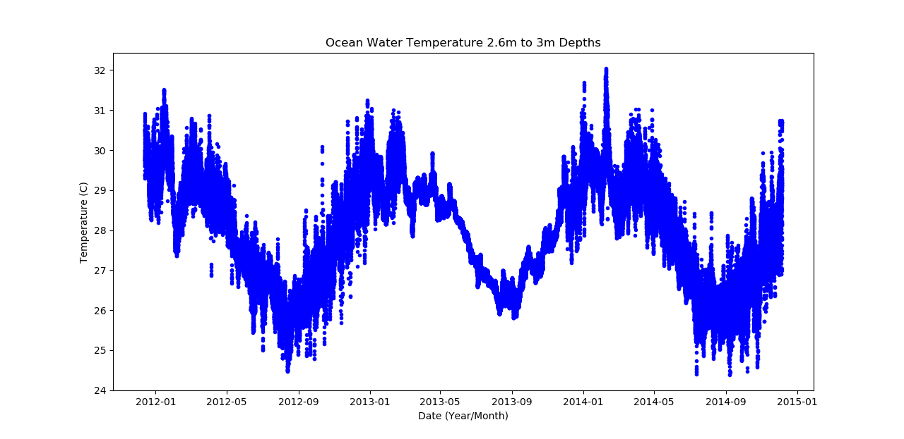
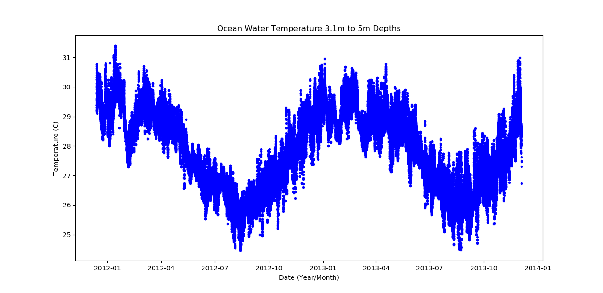
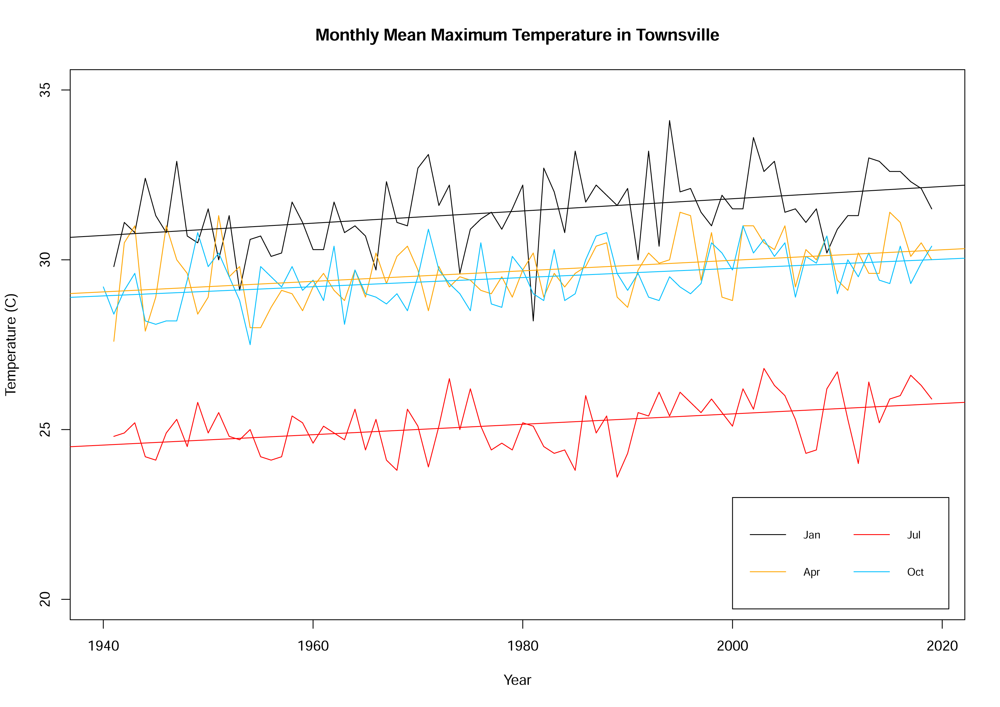
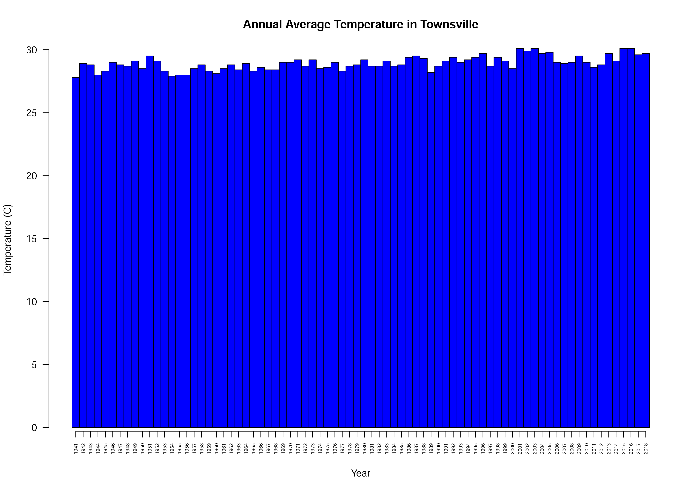

# Data-Visualisation-1

Ocean temperature plotting of data using R.  
Based on Australian Institute of Marine Science data source: https://www.aims.gov.au/docs/data/data.html. Subset of "temp-logger.csv".  
Sampling location: Bramble Cay, QLD, AU.  
Data is located in data.zip.  
Run the R code file with the data file supplied. Two plots will appear (below). These are the raw water temperature measurements.  
There are multiple temperature measurement samples taken per day, hence the vertical stacking of points in the below plots. 

 
 
Ocean temperature plotting of data using MATLAB.  
Based on Australian Institute of Marine Science data source: https://www.aims.gov.au/docs/data/data.html. Subset of "temp-logger.csv".  
Sampling location: Bramble Cay, QLD, AU.  
Data is located in data2.zip.  
Run the MATLAB code file with the data file supplied. Two plots will appear (below). These are the raw water temperature measurements.  
There are multiple temperature measurement samples taken per day, hence the vertical stacking of points in the below plots. 

 
 
Ocean temperature plotting of data using Python.  
Based on Australian Institute of Marine Science data source: https://www.aims.gov.au/docs/data/data.html. Subset of "temp-logger.csv".  
Sampling location: Bramble Cay, QLD, AU.  
Data is located in data2.zip.  
Run the Python code file with the data file supplied. Two plots will appear (below). These are the raw water temperature measurements.  
There are multiple temperature measurement samples taken per day, hence the vertical stacking of points in the below plots. 

  

The below uses R to plot temperatures in Townsville (line graphs with regression line). Four months of each year are plotted. 
Data source: BOM http://www.bom.gov.au/climate/data/index.shtml?bookmark=200. 
Data file name: townsville_temp_BOM.xlsx. 
Plot of Townsville Temperatures: The Monthly mean maximum temperatures from 1940 to 2019. 
Line plots of raw data and also regression lines for four months of the year. 

  

The below uses R to plot temperatures in Townsville (horizontal and vertical bar graphs) 
Data source: BOM http://www.bom.gov.au/climate/data/index.shtml?bookmark=200. 
Data file name: townsville_temp_BOM.xlsx. 
Barplot of Townsville Temperatures: The Annual average maximum temperatures from 1941 to 2018. 
Vertical and horizontal barplots are compiled. 

  

