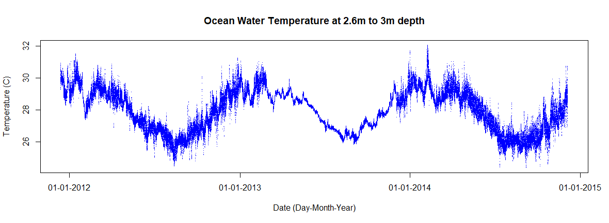

# Data-Analysis-1

Ocean temperature plotting of data using R.  
Data source: AIMS https://www.aims.gov.au/docs/data/data.html. Subset of "temp-logger.csv".  
Sampling location: Bramble Cay, QLD, AU.  
Data is located in data.zip.  
Run the R code file with the data file supplied. Two plots will appear (below). These are the raw water temperature measurements.  
There are multiple temperature measurement samples taken per day, hence the vertical stacking of points in the below plots. 

