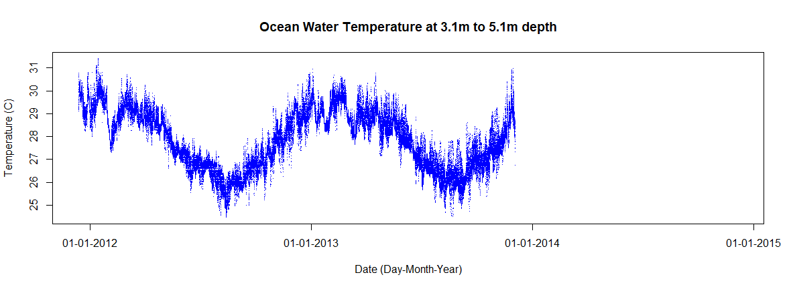

# Data-Analysis-1

Ocean temperature plotting of data using R.  
Data source: AIMS https://www.aims.gov.au/docs/data/data.html. Subset of "temp-logger.csv".
Location: Bramble Cay, QLD, AU.
Data is located in data.zip.
Run the R code file with the data file supplied. Two plots will appear (below). These are the raw water temperature measurements.

